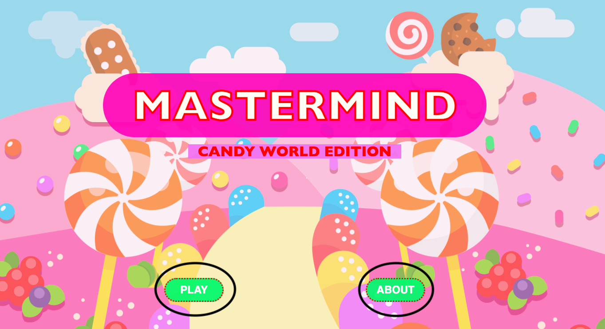
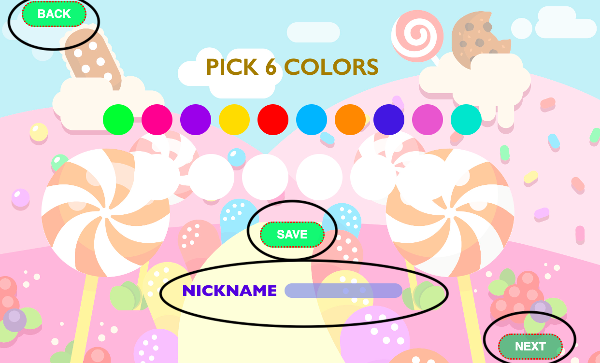
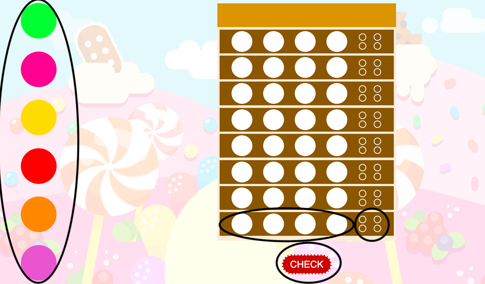

# Mastermind
### 🍬Candy World Edition🍬 

Es un juego online basado en el juego de mesa con el mismo nombre, esta diseñado como una version de un mundo de caramelos. Este proyecto se realizó como parte del Bootcamp Full Stack Developer de Geekshubs Academy.

[Presiona aqui para jugar](https://vanbrigo.github.io/mastermind/)

## Tabla de Contenidos

- ⚙️[Desarrollo](#desarrollo)
- 🌐[Tecnologias Utilizadas](#tecnologias-utilizadas)
- 🕹️[Como jugar](#como-jugar)
- 🚧[Bugs](#Bugs)
- 🛠️[Posibles Mejoras](#posibles-mejoras)
- 📃[Menciones](#menciones)
- 🏷️[Creditos](#creditos)

## Desarrollo
Se crearon 4 funciones principales para el funcionamiento del juego. La primera funcion fue la de combinacionAleatoria, esta funcion rescata los colores seleccionados previamente por el jugador y con el la creacion de un numero random, los va seleccionando e insertando en un array que solo acepta 4 elementos y seria la combinacion ganadora. La siguiente funcion creada fue la de cambioColores, que permite ir recorriendo, en cada circulo de la fila de intento,el array de colores seleccionado por el jugador y una vez se presione el boton Check, se almacenan los datos en un nuevo array y entrarian las dos siguientes funciones. Primero se realizaria la de verificar, que comprueba si el array generado y el array con la combinacion ganadora, son iguales. De ser iguales, entra una nueva pantalla que indica que ganaste, de no ser asi, pasa a la siguiente funcion, la de las pistas, que te indica cuantos de tus colores estan en la posicion correcta y cuantos de ellos no estan en la posicion correcta pero estan presentes en el array ganador.

## Tecnologias Utilizadas

## Como jugar

 
En la pagina home tienes dos botones que seria el boton de about, que te enseña las reglas del juego, y el boton de play, que te lleva a seleccionar los colores.

 
En esta pagina podras elegir los 6 colores con los que deseas jugar, una vez elegidos, hay que presionar "save" para guardar la seleccion. Tambien es necesario introducir el nombre del jugador, una vez introducido, se activa el boton next para que puedas empezar a jugar. En esta pagina tambien se encuentra el boton "back" para volver a la pagina de inicio. De no elegir los colores para el juego, se jugara con los colores prestablecidos.

 
Aqui tienes a la izquierda tu seleccion de colores, la combinacion secreta esta hecha en base a los colores que seleccionaste previamente. Por defecto, se pueden repetir los colores en la combinacion ganadora. Una vez ingreses tu primera linea de suposicion, debes presionar "check" para comprobar tu combinacion. De no ser la combinacion correcta, tendras otras 7 oportunidades y al costado de cada linea de intento, tendras un cuadro de pistas, que pinta el circulo de blanco, en caso de que tu color se encuentre en la combinacion secreta pero no este en la posicion que indicas, y de negro, en caso de que hayas acertado el color y la posicion de este. 

## Bugs
Las pistas marcan blanco cuando el color se encuentra en la combinacion ganadora, si intentas ingresar un color que ya sabes que esta en la combinacion ganadora, pero ahora intentas adivinar si esta tambien en otra posicion, por defecto te lo marcara como blanco(es decir, que se encuentra en la combinacion ganadora).

## Posibles mejoras
Entre las mejoras pensadas para este proyecto, se encuentra el mostrar en los circulos blancos de la pagina de seleccion, los colores que se van eligiendo, segun se va clickando y no una vez guardados. Tambien se considera poner niveles de dificultad.

## Menciones
Gracias a mis compañeros del Bootcamp por las dudas resueltas y a mis profesores por los conocimientos compartidos.

## Creditos
Este proyecto ha sido realizado por Vanessa Brito, estudiante de Geeks Hubs Academy 2023.

